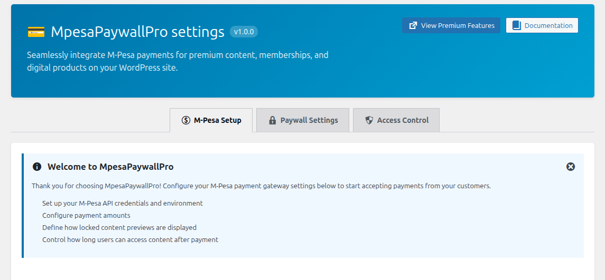

# MpesaPaywallPro

A WordPress plugin that integrates the M-Pesa payment gateway and enables you to restrict premium content behind a paywall, allowing you to monetize your website effectively.



## Table of Contents

- [Features](#features)
- [Requirements](#requirements)
- [Installation](#installation)
- [Configuration](#configuration)
- [Usage](#usage)
- [Plugin Structure](#plugin-structure)
- [Author & Contact](#author--contact)
- [Contributing](#contributing)
- [License](#license)
- [Support](#support)

## Features

- **M-Pesa Payment Integration**: Seamless integration with the M-Pesa payment gateway
- **Content Paywall**: Restrict premium content behind a secure paywall
- **Easy Configuration**: Simple admin interface for setup and management
- **Responsive Design**: Mobile-friendly payment interface
- **Secure Transactions**: Encrypted payment processing
- **User Management**: Track user subscriptions and access
- **Multiple Content Types**: Protect pages, posts, or custom content
- **Plugin Update Checker**: Automatic update notifications from GitHub

## Requirements

- **WordPress**: 6.2.1 or higher
- **PHP**: 7.4 or higher (recommended: 8.1+)
- **Composer**: For dependency management
- **M-Pesa Account**: M-Pesa daraja Details

## Installation

### Method 1: Manual Installation

1. Download the plugin files from the [GitHub repository](https://github.com/peanutsx50/MpesaPaywallPro)
2. Extract the plugin folder to `/wp-content/plugins/` directory
3. Navigate to **Plugins** in your WordPress admin panel
4. Find **MpesaPaywallPro** and click **Activate**

### Method 2: Upload via WordPress Admin

1. In your WordPress admin panel, go to **Plugins** → **Add New**
2. Click **Upload Plugin**
3. Select the plugin zip file and click **Install Now**
4. Click **Activate Plugin**

## Configuration

### Initial Setup

1. After activation, navigate to the plugin settings in the WordPress admin panel
2. Configure your M-Pesa merchant details:
   - Consumer Key
   - Consumer Secret
   - Business Shortcode
   - Pass Key
   - Environment (Sandbox/Production)

3. Set up payment options:
   - Payment amounts

### Dashboard

The plugin admin interface provides:

- **Overview**: Summary of recent transactions and subscription status
- **Settings**: M-Pesa and general configuration options
- **Subscriptions**: Manage user subscriptions and access
- **Reports**: View payment history and analytics

## Usage

### Protecting Content

1. **Edit a Post/Page**: Navigate to the post or page you want to protect
2. **Paywall Settings**: Look for the MpesaPaywallPro meta box
3. **Enable Paywall**: Check "Enable Paywall for this content"
4. **Set Price**: Enter the amount users must pay to access
5. **Publish**: Save your changes

### User Experience

Users visiting protected content will:

1. See a paywall notice with the payment amount
2. Click the "Unlock Content" button
3. Enter their phone number
4. Complete the M-Pesa payment
5. Gain immediate access to protected content

### Payment Flow

```
User Views Protected Content
    ↓
Paywall Displayed
    ↓
User Initiates Payment
    ↓
M-Pesa Prompt Sent to Phone
    ↓
User Enters M-Pesa PIN
    ↓
Payment Processed
    ↓
Content Access Granted
```

### Local Development with ngrok

To test the plugin locally with HTTPS (required for secure M-Pesa callbacks), you can use ngrok to expose your local WordPress installation.

#### Setup Steps

1. **Install ngrok**: Download from [ngrok.com](https://ngrok.com) or install via package manager

2. **Configure wp-config.php**: Add the following code to your `wp-config.php` file before the line `/* That's all, stop editing! */`:

```php
define('WP_HOME', 'https://XXXX.ngrok-free.dev');
define('WP_SITEURL', 'https://XXXX.ngrok-free.dev');

define('FORCE_SSL_ADMIN', true);
define('FORCE_SSL_LOGIN', true);

if (isset($_SERVER['HTTP_X_FORWARDED_PROTO']) && $_SERVER['HTTP_X_FORWARDED_PROTO'] === 'https') {
    $_SERVER['HTTPS'] = 'on';
}
```

Replace `XXXX` with your actual ngrok subdomain.

3. **restart apache2**: once you add the code to your wp-config, you need to restart apache2 for changes to take effect
```bash
sudo systemctl restart apache2
```

4. **Start ngrok**: Run the following command in your terminal:

```bash
ngrok http <port>
```

Replace `<port>` with your local WordPress server port (typically 8000, 8080, 3000, etc.)

Example:
```bash
ngrok http 8000
```

5. **Test Payment Flow**: You can now test M-Pesa payment processing with full HTTPS support

## Plugin Structure

```
MpesaPaywallPro/
├── admin/                          # Admin panel functionality
│   ├── MpesaPaywallProAdmin.php   # Admin class
│   ├── css/                        # Admin styles
│   ├── js/                         # Admin scripts
│   └── partials/                   # Admin templates
├── includes/
│   ├── base/
│   │   ├── MpesaPaywallPro.php           # Core plugin class
│   │   ├── MpesaPaywallProActivator.php  # Activation hooks
│   │   ├── MpesaPaywallProDeactivator.php # Deactivation hooks
│   │   ├── MpesaPaywallProI18n.php       # Internationalization
│   │   └── MpesaPaywallProLoader.php     # Hook loader
│   └── core/
|   |   └── MpesaPaywallProMpesa.php # M-Pesa API integration
|   ├── public/                         # Frontend functionality
│   ├── css/                        # Frontend styles
│   ├── js/                         # Frontend scripts
│   └── partials/                   # Frontend templates
├── languages/                      # Translation files
├── vendor/                         # Composer dependencies
├── MpesaPaywallPro.php            # Main plugin file
├── composer.json                   # Dependency configuration
└── README.md                       # This file
```

## Author & Contact

**Surge Technologies**

- **Email**: [admin@surgetech.co.ke](mailto:admin@surgetech.co.ke)
- **LinkedIn**: [Surge Technologies](https://surgetech.co.ke/)
- **Website**: [MpesaPaywallPro](https://surgetech.co.ke/mpesapaywallpro)
- **Gumroad**: [GumroadMpesaPaywallPro](https://festuswp.gumroad.com/l/BPMpesaGateway)

## Contributing

We welcome contributions! Here's how you can help:

### Development Setup

1. Fork the repository on GitHub
2. Clone your fork locally:

   ```bash
   git clone git@github.com:peanutsx50/MpesaPaywallPro.git
   ```

3. Create a feature branch:

   ```bash
   git checkout -b feature/your-feature-name
   ```

4. Make your changes and commit:

   ```bash
   git commit -am 'Add your feature description'
   ```

5. Push to your fork:

   ```bash
   git push origin feature/your-feature-name
   ```

6. Submit a Pull Request on the main repository

### Code Standards

- Follow WordPress coding standards
- Use PSR-4 namespacing
- Add appropriate PHPDoc comments
- Ensure backward compatibility

### Reporting Issues

Found a bug? Please report it on our [GitHub Issues](https://github.com/peanutsx50/MpesaPaywallPro/issues) with:

- Detailed description of the issue
- Steps to reproduce
- Expected vs. actual behavior
- WordPress and PHP versions
- Any relevant error logs

## License

MpesaPaywallPro is licensed under the **GNU General Public License v2 or later**.

For full license details, see [LICENSE.txt](LICENSE.txt)

You are free to:

- ✅ Use the plugin on as many sites as you wish
- ✅ Modify the code to fit your needs
- ✅ Distribute the plugin (with proper attribution)

## Support

### Documentation

- Check the [GitHub Wiki](https://github.com/peanutsx50/MpesaPaywallPro/wiki) for detailed guides
- Review [Frequently Asked Questions](#frequently-asked-questions)

### Getting Help

1. **Search existing issues**: Check if your question has been answered
2. **Create a new issue**: If not, describe your problem in detail
3. **Contact**: Reach out via email or LinkedIn

## Frequently Asked Questions

### Q: Can I test the plugin in sandbox mode?

**A**: Yes! Configure the plugin to use M-Pesa's sandbox environment during testing.

### Q: What payment methods does this support?

**A**: Currently, the plugin supports M-Pesa payments. Additional payment gateways may be added in future releases.

### Q: Can I customize the paywall appearance?

**A**: Yes, you can modify the templates in the `public/partials/` directory or use WordPress hooks and filters.

### Q: How do I get reports of transactions?

**A**: Navigate to the Reports section in the plugin admin panel to view detailed transaction history.

### Q: What happens if a user already paid?

**A**: The plugin automatically grants access to users who have completed payment. Repeat attempts to access will not charge again.

## Version History

### v1.0.0 (Initial Release)

- M-Pesa payment gateway integration
- Content paywall functionality
- Admin dashboard
- Plugin update checker

## Roadmap

Future enhancements planned:

- [ ] Advanced analytics and settings dashboard
- [ ] Email notifications and reminders
- [ ] Additional payment gateways
- [ ] Multiple payment plans (daily, monthly, yearly)

## Security & Privacy

- All payment data is encrypted
- No sensitive information is stored on your server
- Compliant with M-Pesa security standards
- GDPR compliant data handling

## Acknowledgments

- [Yahnis Elsts Plugin Update Checker](https://github.com/YahnisElsts/plugin-update-checker) for update functionality
- WordPress community for guidelines and best practices
- M-Pesa for payment processing

---

**Need help?** Create an issue on GitHub or contact the me directly via email.

**Enjoying the plugin?** Please give it a ⭐ on GitHub!
